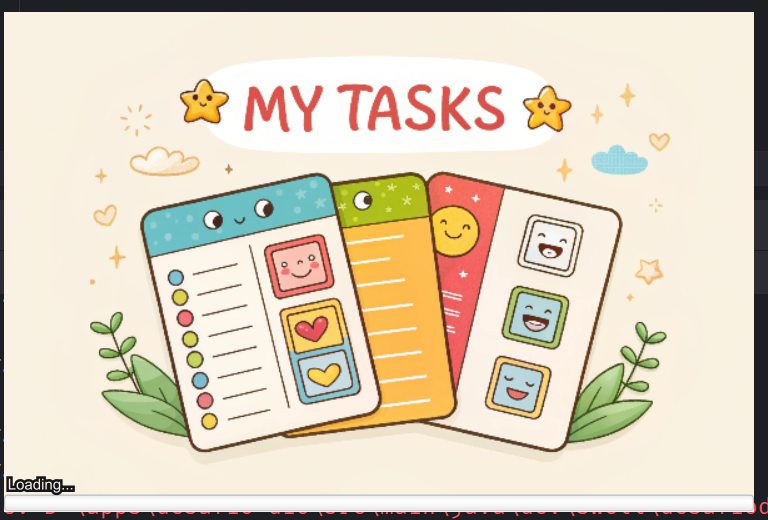
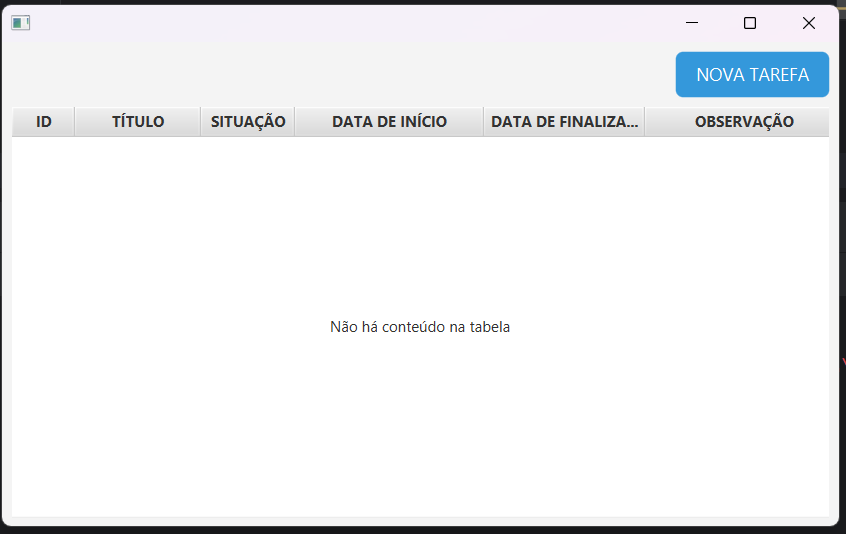

# Primeiro Desafio do Bootcamp Santander 2025 - Java

## 💡 Sobre o Projeto

O desafio consiste em criar uma aplicação de gerenciamento de tarefas via terminal. No entanto, optei por desenvolver uma interface gráfica utilizando **JavaFX**. A aplicação permite:

- Cadastrar, editar, excluir e atualizar tarefas;
- Validação de regras específicas para as tarefas;
- Gerenciamento visual mais intuitivo.

### ✅ Regras de negócio implementadas

- Uma tarefa **não pode** ser cadastrada com data anterior à data atual;
- A **data final** da tarefa **não pode** ser igual ou anterior à data de início;
- Tarefas que **passaram do prazo** e **não foram concluídas** são marcadas como **atrasadas**;
- Cada tarefa possui um **estado**, podendo ser:
    - Não iniciada
    - Iniciada
    - Pendente
    - Finalizada

## 🚀 Funcionalidades Implementadas

- Tela de splash
- Tela principal (dashboard)
- Tela de cadastro de tarefas
- Sistema de navegação entre telas via **View Manager**
- Integração com **Flyway** para migração do banco de dados
- Persistência de dados com **JPA + Hibernate**

## 🧰 Tecnologias Utilizadas

- **Java 17**
- **JavaFX** (interface gráfica)
- **MariaDB** (banco de dados relacional)
- **JPA (Jakarta Persistence API)** (mapeamento objeto-relacional)
- **Hibernate** (implementação do JPA)
- **Flyway** (controle de versões do banco)
- **Maven** (gerenciador de dependências)
- **Figma** (design das telas)
- **SceneBuilder** (auxílio na construção das views)

## 🖼️ Algumas Imagens da Aplicação

### Tela de Splash

### Tela Inicial

### Tela de Cadastro

### Tela Inicial com Dados

## 🔧 Próximos Passos

- Refatorar o banco de dados
- Adaptar o modelo para seguir o padrão **MVVM**
- Melhorar o fluxo de navegação entre telas
- Implementar testes unitários
- Adicionar filtros, ordenação e paginação nas consultas
- Criar um repositório genérico com JPA para facilitar o CRUD

